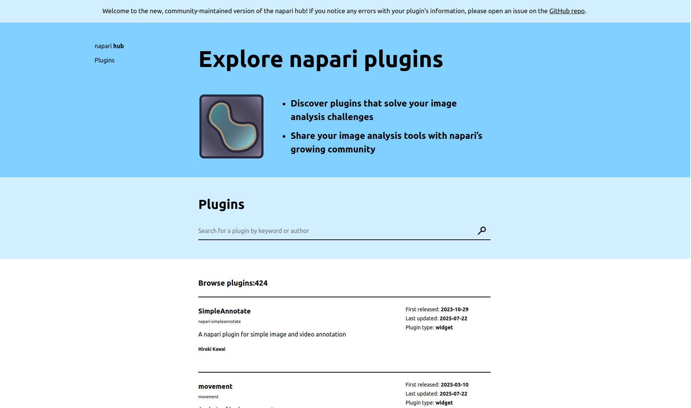

# Napari Hub Lite - [napari.org/hub-lite](napari.org/hub-lite)

[](https://github.com/napari/hub-lite/actions/workflows/build_and_deploy.yml)
[](https://results.pre-commit.ci/latest/github/napari/hub-lite/main)

This implementation of the napari hub is developed and managed by the napari team. It is based on an original implementation by Yunha Lee.

The website is deployed daily using GitHub pages and contains plugin information served by [npe2api](https://github.com/napari/npe2api). This GitHub repository contains the Python scripts, javascript, HTML
templates and CSS templates required to build the web pages.



The `fetch_napari_data.py` script queries [npe2api](https://github.com/napari/npe2api) for plugin information including PyPI/conda info and individual plugin manifests.

The `create_static_html_files.py` script uses this data to generate HTML files for each individual plugin page as well as for the plugin listing on the website's homepage.

The `entire_text_search.js` file filters the plugin list to plugins matching the query in the search box. 

The `build_and_deploy.yml` workflow builds the website using the above scripts and deploys it to GitHub pages.

## Local Development

Ensure you have the following prerequisites installed:

- Python 3.x
- Other dependencies listed in `requirements.txt`

### Building the Website

To build the website locally use:

```sh
# this deletes the `_build` directory and everything inside it
make clean

# this runs the required Python scripts and populates the `_build` directory
make all
```

### Serving the Website Locally

To serve the website locally in your browser use:

```sh
make serve-local
```

### Acknowledgments
This project makes extensive use of the design and html resources from the original [napari hub](https://github.com/chanzuckerberg/napari-hub/). All resources are used with permission. 
