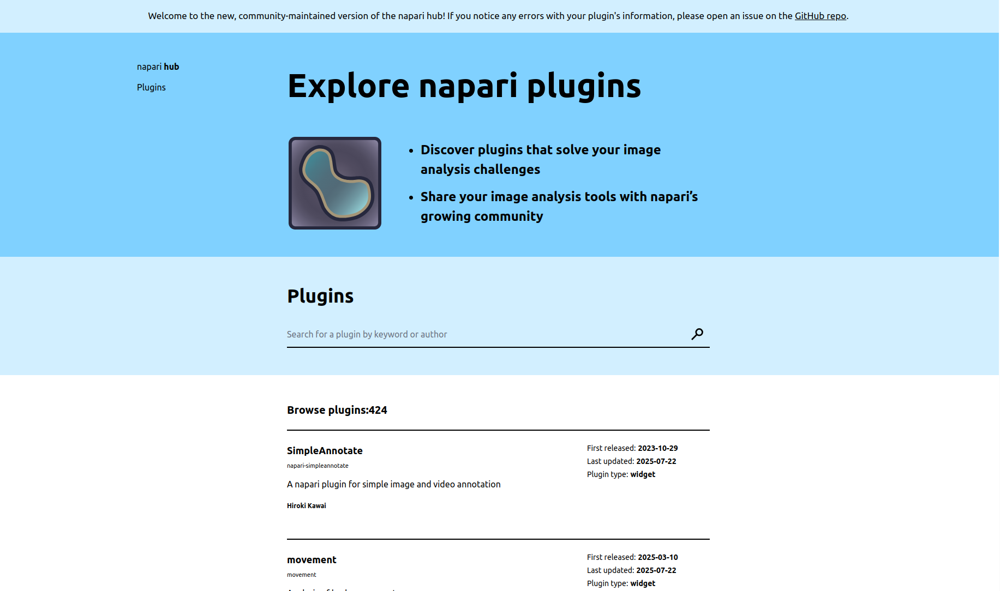

# Napari Hub Lite - [napari.org/hub-lite](napari-hub.org)

[](https://github.com/napari/hub-lite/actions/workflows/build_and_deploy.yml)
[](https://results.pre-commit.ci/latest/github/napari/hub-lite/main)

This implementation of the napari hub is developed and managed by the napari team. It is based on an original implementation by Yunha Lee.

The website is deployed daily using GitHub pages and contains plugin information served by [npe2api](https://github.com/napari/npe2api). This GitHub repository contains the Python scripts, javascript, HTML
templates and CSS templates required to build the web pages.



## How the site works

The site is a static build with a small Python-based generator.

1. `build_site.py` orchestrates the local build, copies shared assets into `_build/`, and runs the data and HTML generation steps.
2. `fetch_napari_data.py` fetches plugin data from [npe2api](https://github.com/napari/npe2api) for plugin information including PyPI/conda info and individual plugin manifests, then writes build data into `_build/data/`.
3. `create_static_html_files.py` reads `_build/data/plugin_page_data.json` and generates:
	- `_build/plugins/*.html` for individual plugin pages
	- `_build/plugins_list.html` for the homepage plugin list
4. `index.html` is the homepage shell and `static/js/plugin_loading_and_search.js` loads the generated plugin list and client-side search behavior.
5. `.github/workflows/build_and_deploy.yml` runs `make all` and publishes `_build/` to GitHub Pages.

The key implementation surfaces are:

- `fetch_napari_data.py`: external data fetching and normalization
- `create_static_html_files.py`: HTML generation and markdown rendering
- `templates/each_plugin_template.html`: plugin detail page template
- `index.html`: homepage structure
- `static/js/plugin_loading_and_search.js`: homepage interactivity
- `static/css/`: copied styling assets used by the generated pages

## Local Development

### Quick Start with pixi:

To build the website locally:
```sh
# install pixi if you don't have it already
pixi run build
```
or to serve the site locally in your browser:
```sh
pixi run serve-local
```

### Development Workflow

All tasks are available through `build_site.py` and can be run with `uv`, `pixi`, or make. The tasks are:

- `clean`: deletes the `_build/` directory and everything inside it, so use with caution. This is the first step in a full build, but you can also run it separately if you want to start from a clean slate.
- `prep`: copies static assets into `_build/` and prepares the build environment, but does not run the data fetching or HTML generation steps, so it is fast to run and can be used before `fetch-data` or `create-html` for iterative development.
- `fetch-data`: runs the data fetching step, which can be slow due to the number of plugins and API calls, but is only needed when plugin data changes.
- `create-html`: runs the data fetching and HTML generation steps, but does not clean or copy static assets, so it is faster for iterative development.

### Recommended: pixi

[Pixi](https://pixi.sh) is the easiest cross-platform way to build the site locally.

Useful tasks:

- `pixi run clean`
- `pixi run prep`
- `pixi run fetch-data`
- `pixi run create-html`
- `pixi run build`
- `pixi run serve-local`

### Alternative: uv

If you prefer a Python-native workflow without Pixi, use [`uv`](https://docs.astral.sh/uv/getting-started/installation/) against the same
`pyproject.toml` manifest. This uses the commands that make wraps, so the underlying Python scripts are the same as with Pixi. E.g.

- `uv run python build_site.py all`
- `uv run python build_site.py serve-local`

### Acknowledgments

This project makes extensive use of the design and html resources from the original [napari hub](https://github.com/chanzuckerberg/napari-hub/). All resources are used with permission. 
